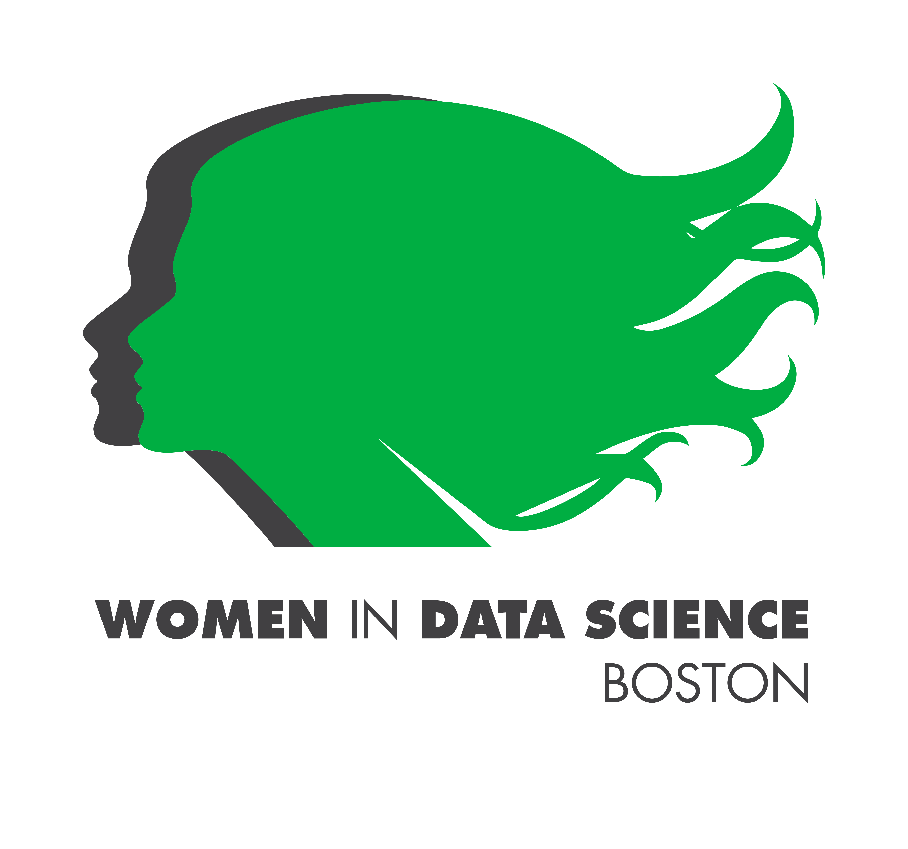

# WiDS Boston 2021

## Applications of Data Science         


```{r, echo=FALSE ,message = FALSE , warning = FALSE}
library(tidyverse)
library(gt)
```

```{r, echo=FALSE}
Time <-   c("12:00 - 12:40 pm","12:40 - 1:10 pm","1:10 - 1:30 pm")

data.frame(cbind(
  Time,
  Speaker =  c(
    "Monica Ramirez, University of Arizona",
    "Johanna Pingel, MathWorks",
    "Sirma Orguc, MIT"
  ),
  Topic = c("Environmental Health","Medical Imaging","Biomedical System Design")
)
) %>% 
  gt() %>% 
  tab_header(title = md("29 Apr 2021"))


```

------------------------------------------------------------------------

```{r, echo=FALSE}

data.frame(cbind(
  Time,
  Speaker =  c(
    "Maura Walker, Boston University",
    "Sara Saperstein, MassMutual",
    "Elvira Osuna-Highley, Mathworks"
  ),
  Topic = c("Nutrition","Cybersecurity","High-throughput Imaging")
)
) %>% 
  gt() %>% 
  tab_header(title = md("30 Apr 2021"))

```

------------------------------------------------------------------------

### Agenda Details

**Monica Ramirez - Community Science and Data Integration to Address Environmental Health Disparities**

Abstract - Pollution is now the leading global cause of premature death and disease. Environmental contamination is a fundamental determinant of health, and when the environment is compromised, vulnerabilities are generated. To solve "wicked" dilemmas, disparate public health surveillance efforts are conducted by local, state and federal agencies. Concomitantly, community science (CS) programs are also generating valuable environmental quality datasets. One of the biggest challenges in using these government datasets, let alone incorporating CS data, for a holistic assessment of environmental exposure is that the datasets generated by each group are independent and siloed from one another, leading to a lack of standardization, interoperability, application of FAIR principles of data management and stewardship. To address this challenge, we used a transdisciplinary research framework to develop a methodology to integrate CS data with existing governmental environmental monitoring and social attribute data (vulnerability and resilience variables) that span across ten different federal and state agencies. We are also developing a stakeholder analysis to further inform the vulnerability and resilience variables as well as the interactive data visualization approach that will be used for analysis and broad dissemination. This methodology: (1) integrates CS environmental monitoring data with other data sets to enhance discoverability and reuse of data for research translation and (2) enables better hypothesis generation. An anticipated result of this integration effort is that it will help determine if and how community-level resiliencies may combat environmental health vulnerabilities. We anticipate that this method will help to address environmental health disparities, while ensuring CS datasets are ethically integrated to achieve EJ.

**Johanna Pingel - Case studies of deep learning applications in Physics and Medical Imaging**

Abstract - Deep Learning is often talked about at the data or model level, but what are some of the unique ways researchers are implementing these models? In this talk, we'll discuss various case studies of deep learning in physics, medical imaging, and other research. We'll also discuss creative ways to describe and attract more readers to research through blogs and social media.

**Sirma Orguc - A wavelet-based real-time facial recognition algorithm**

Abstract - This work presents an EMG-based facial gesture recognition platform. The system integrates a custom-designed EMG sensor interface for energy-efficient signal acquisition from a small footprint. The gesture recognition algorithm achieves the classification of resting, clenching, chewing, and jaw opening activities in real-time. A wavelet-transform-based feature extraction improves the computational efficiency of the machine learning algorithm.

**Maura Walker - Data science applications to facilitate precision nutrition for disease prevention**

Abstract - The field of Nutrition Science is fraught with low-quality research leading to changing guidelines and consumer confusion. Dr. Walker will discuss how data science has reshaped the way we conduct nutrition research and the promise for data science applications to facilitate precision nutrition for disease prevention.

**Sara Saperstein - Using data science and analytics together for effective enterprise cyber security decision making**

Abstract - Data science and data analytics provide powerful tools for enterprise cyber security but organizations often struggle to leverage them effectively. Two of the major challenges include: where to leverage data science models and how to evaluate their effectiveness. This talk will showcase some of the approaches used at MassMutual to assess threats, develop unconventional controls using machine learning models, and evaluate the effectiveness of controls at mitigating the top risks to the organization. This approach enables evidence-based decision making, leading to stronger trust in the cyber security program.

**Elvira Osuna-Highley - Applying machine learning to fluorescence microscope images**

Abstract- This session will discuss approaches to analyzing large-scale image collections for the purpose of studying subcellular location. High-throughput imaging techniques and unsupervised machine learning methods were used to analyze NIH 3T3 cell clones. Analysis of these cell clones expressing different tagged proteins suggests that approximately 40 protein patterns are distinguishable under the high-throughput imaging conditions used.

------------------------------------------------------------------------

#### Note About This Event

WiDS Boston is an independent event organized by Priyanka Gagneja and Neha Sardesai to coincide with the annual Women in Data Science (WiDS) Worldwide conference hosted by Stanford University and an estimated 150+ locations worldwide. All genders are invited to attend WiDS events, which feature outstanding women doing outstanding work.
